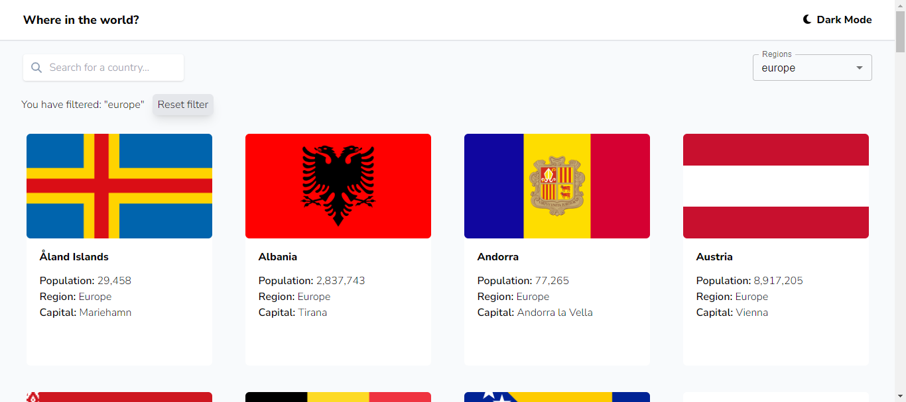
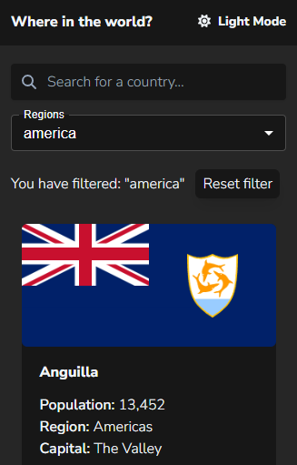
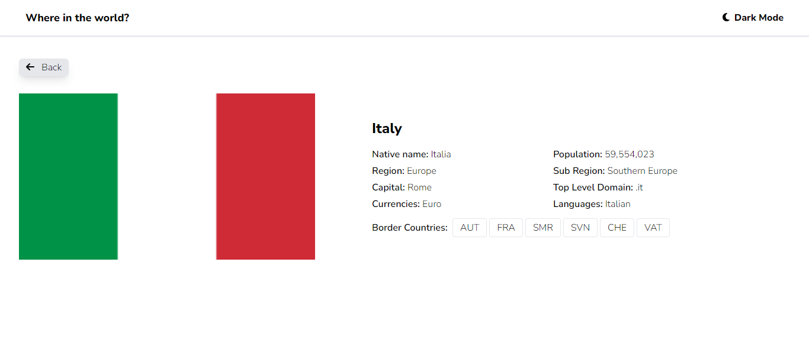
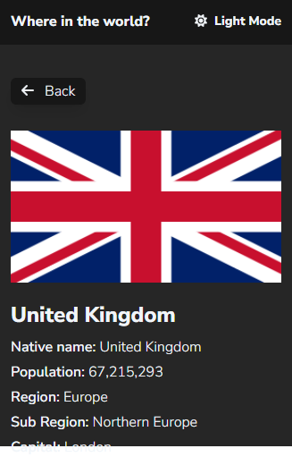

# Frontend Mentor - REST Countries API with color theme switcher solution

This is a solution to the [REST Countries API with color theme switcher challenge on Frontend Mentor](https://www.frontendmentor.io/challenges/rest-countries-api-with-color-theme-switcher-5cacc469fec04111f7b848ca) with some UI modifications. Frontend Mentor challenges help you improve your coding skills by building realistic projects.

## Table of contents

- [Overview](#overview)
  - [The challenge](#the-challenge)
  - [Screenshot](#screenshot)
  - [Links](#links)
- [My process](#my-process)
  - [Built with](#built-with)
- [Author](#author)

## Overview

### The challenge

Users should be able to:

- See all countries from the API on the homepage
- Search for a country using an `input` field
- Filter countries by region
- Click on a country to see more detailed information on a separate page
- Toggle the color scheme between light and dark mode

### Screenshot

### Links

[Live Site URL](https://countries-frontendmentor.netlify.app/)

## My process

### Built with

- Semantic HTML5 markup
- CSS custom properties
- Flexbox
- Mobile-first workflow
- [REST Countries API](https://restcountries.com/)
- [React](https://reactjs.org/)
- [React Query](https://tanstack.com/query/v3/)
- [React Router](https://www.npmjs.com/package/react-router-dom)
- [Tailwind CSS](https://tailwindcss.com/)
- [MaterialUI](https://mui.com/)
- [React Spinners](https://www.npmjs.com/package/react-spinners)
- [Flaticon](https://www.flaticon.com/) - for the favicon

## Author

Chiara Stefanelli - Front-End Development Student based in Italy

- Website - [Chiara Stefanelli](https://chiarastefanelli.netlify.app/)
- LinkedIn - [Chiara Stefanelli](https://www.linkedin.com/in/chiarastefanelli/?locale=en_US)
- Frontend Mentor - [Chiara Stefanelli](https://www.frontendmentor.io/profile/chiarastef)
